# Esquema de base de datos — Flota

Diagrama Entidad-Relación de la app (generado a partir de los modelos de
`back/accounts` y `back/fleet`). Se renderiza automáticamente en GitHub y en el
preview de Markdown de VS Code (Mermaid).

**Leyenda de cardinalidad:** `||` = uno · `o{` = cero o muchos · `o|` = cero o uno.
`PK` clave primaria · `FK` clave foránea. Los campos `*_enum` se detallan al final.

```mermaid
erDiagram
    USER ||--o{ USER_ROLE : "tiene"
    USER ||--o{ VEHICLE : "supervisa"
    USER ||--o{ ASSIGNMENT : "conduce"
    USER ||--o{ VEHICLE_USAGE : "usa"

    BUSINESS_UNIT ||--o{ VEHICLE : "agrupa"
    COUNTRY ||--o{ VEHICLE : "ubica"
    PROJECT ||--o{ VEHICLE : "financia"

    VEHICLE ||--o{ CONTRACT : "tiene"
    RENTING ||--o{ CONTRACT : "provee"
    VEHICLE ||--o{ KM_READING : "registra"
    VEHICLE ||--o{ ASSIGNMENT : "se asigna"
    VEHICLE ||--o{ VEHICLE_USAGE : "reparte"
    VEHICLE ||--o{ VEHICLE_LINK : "principal"
    VEHICLE ||--o{ VEHICLE_LINK : "sustituto"
    VEHICLE ||--o{ EVENT : "genera"
    VEHICLE ||--o{ INVOICE : "factura"
    VEHICLE ||--o{ INCIDENT : "sufre"
    VEHICLE ||--o{ DOCUMENT : "documenta"
    INCIDENT ||--o{ DOCUMENT : "adjunta"
    USER ||--o{ DOCUMENT : "sube"
    VEHICLE ||--o{ ALERT : "genera"
    USER ||--o{ ALERT : "destinatario"

    EVENT ||--o| EVENT_PENALTY : "detalle"
    EVENT ||--o| EVENT_FEE_CHANGE : "detalle"
    EVENT ||--o| EVENT_ITV : "detalle"
    EVENT ||--o| EVENT_PROJECT_CHANGE : "detalle"
    EVENT ||--o| EVENT_LOCATION_CHANGE : "detalle"
    EVENT ||--o| EVENT_PEP_CHANGE : "detalle"
    EVENT ||--o| EVENT_DRIVER_CHANGE : "detalle"

    PROJECT ||--o{ EVENT_PROJECT_CHANGE : "cambio"
    PEP ||--o{ EVENT_PEP_CHANGE : "cambio"
    USER ||--o{ EVENT_DRIVER_CHANGE : "cambio"

    INVOICE ||--o{ INVOICE_ALLOCATION : "imputa"
    PROJECT ||--o{ INVOICE_ALLOCATION : "recibe"
    PEP ||--o{ INVOICE_ALLOCATION : "recibe"

    USER {
        int id PK
        string username
        string email
        string first_name
        string last_name
        bool fuel_card
        string dni UK
        string phone
        enum license_type
        bool is_active
    }
    USER_ROLE {
        int id PK
        int user_id FK
        enum role "admin | supervisor | driver"
    }

    COUNTRY {
        int id PK
        string name
    }
    BUSINESS_UNIT {
        int id PK
        string code
        string name
    }
    PROJECT {
        int id PK
        string project_name
    }
    PEP {
        int id PK
        string code
        string name
    }
    RENTING {
        int id PK
        string name
    }

    VEHICLE {
        int id PK
        string plate UK
        string brand
        string model
        string version
        int year
        string vin
        date registration_date
        enum state "state_enum"
        bool is_substitute
        int supervisor_id FK "USER"
        int business_unit_id FK
        int country_id FK
        int project_id FK
        int cost_center_id FK "PEP (CECO)"
        enum fuel "fuel_enum"
        enum type "type_enum"
        enum size "size_enum"
        enum market_segment "market_segment_enum"
        enum veh_use "veh_use_enum"
        enum property "property_type_enum"
        enum business_use "use_type_enum"
        int consumption
        int km_start
        int km_end
        date next_itv_date "denormalizado del último EventItv"
    }

    CONTRACT {
        int id PK
        int vehicle_id FK
        int renting_id FK
        string contract_number
        int contract_time "meses"
        int contract_km
        string client
        string cif
        date start_date
        date planned_end_date
        date end_date
        decimal month_fee
    }
    KM_READING {
        int id PK
        int vehicle_id FK
        date reading_date
        int km_reading
    }

    ASSIGNMENT {
        int id PK
        int vehicle_id FK
        int driver_id FK "USER"
        date start_date
        date end_date "NULL = en curso"
        enum status "propuesta|aceptada|rechazada|finalizada"
        decimal usage_percent
        datetime created_at
    }
    VEHICLE_USAGE {
        int id PK
        int vehicle_id FK
        int driver_id FK "USER"
        decimal usage_percent "suma=100"
        date start_date
        date end_date
    }
    VEHICLE_LINK {
        int id PK
        int main_vehicle_id FK "VEHICLE"
        int substitute_vehicle_id FK "VEHICLE"
        enum reason "link_reason_enum"
        date start_date
        date end_date "NULL = activo"
        datetime created_at
    }

    EVENT {
        int id PK
        int vehicle_id FK
        enum event_type "events_enum"
        date event_date
        string notes
    }
    EVENT_PENALTY {
        int event_id PK "FK EVENT"
        decimal amount
        bool paid
    }
    EVENT_FEE_CHANGE {
        int event_id PK "FK EVENT"
        decimal old_fee
        decimal new_fee
    }
    EVENT_ITV {
        int event_id PK "FK EVENT"
        string result "done | not done"
        date next_due
    }
    EVENT_PROJECT_CHANGE {
        int event_id PK "FK EVENT"
        int old_project_id FK
        int new_project_id FK
    }
    EVENT_LOCATION_CHANGE {
        int event_id PK "FK EVENT"
        string old_location
        string new_location
    }
    EVENT_PEP_CHANGE {
        int event_id PK "FK EVENT"
        int old_pep_id FK
        int new_pep_id FK
    }
    EVENT_DRIVER_CHANGE {
        int event_id PK "FK EVENT"
        int old_driver_id FK "USER"
        int new_driver_id FK "USER"
    }

    INVOICE {
        int id PK
        string code
        int vehicle_id FK
        date date
        decimal amount
        string file "ruta/URL al PDF"
    }
    INVOICE_ALLOCATION {
        int id PK
        int invoice_id FK
        enum target_type "proyecto | pep"
        int project_id FK
        int cost_center_id FK "PEP"
        decimal percentage "suma=100"
        decimal amount
        datetime created_at
    }
    INCIDENT {
        int id PK
        int vehicle_id FK
        enum type "incident_type"
        date date
        string description
        enum status "incident_status"
        decimal cost
    }
    DOCUMENT {
        int id PK
        int vehicle_id FK
        enum type "document_type"
        int incident_id FK
        string drive_url
        int uploaded_by_id FK "USER"
        date expiry_date
        enum status "document_status"
        int replaces_id FK "DOCUMENT (versión anterior)"
        string notes
    }
    ALERT {
        int id PK
        enum type "alert_type"
        enum level "alert_level"
        enum status "alert_status"
        int vehicle_id FK
        int user_id FK "USER (destinatario)"
        string message
        date due_date
        string dedup_key UK "idempotencia de los jobs"
        datetime resolved_at
        int resolved_by_id FK "USER"
    }
```

## Notas del modelo

- **Persona = `USER`.** La tabla `drivers` del DBML se unifica con el usuario de
  autenticación: administradores, supervisores y conductores son todos `USER`.
  Los roles son **multi-valor** (`USER_ROLE`, mapea `driver_roles`).
- **El conductor de un vehículo va por `ASSIGNMENT`** (no hay campo directo en
  `VEHICLE`). `VEHICLE.supervisor_id` es el responsable, opcional.
- **`VEHICLE_LINK`** relaciona un vehículo principal con su sustituto (dos FK a
  `VEHICLE`).
- **Eventos:** `EVENT` guarda lo común y cada subtipo (`EVENT_*`) es una
  extensión 1-a-1 con la PK compartida (solo existe la que aplica al tipo).
- **Facturas:** `INVOICE_ALLOCATION` imputa cada factura a un `PROJECT` o a un
  `PEP`/CECO; la suma de porcentajes por factura = 100.
- **Alertas:** `ALERT` es una bandeja de avisos derivados (ITV escalonada,
  lectura de km pendiente, exceso de km, sin conductor) que generan los trabajos
  programados de forma idempotente (`dedup_key` única). No es negocio: es la capa
  de notificación sobre datos derivados.
- **Timestamps:** todas las tablas de dominio (`fleet.*`) tienen `created_at` y
  `updated_at` (vía `TimeStampedModel`); se omiten en el diagrama por brevedad.

## Enumerados

| Enum | Valores |
|------|---------|
| `role` | `admin`, `supervisor`, `driver` |
| `state_enum` | `active`, `maintenance`, `itv`, `broken`, `baja`, `non_active`, `accidente` |
| `license_type` | `B`, `C1`, `C`, `C+E`, `D1`, `D` |
| `type_enum` | `turismo`, `furgoneta`, `camion`, `motocicleta` |
| `size_enum` | `pequeno`, `mediano`, `grande` |
| `market_segment_enum` | `mini`, `supermini`, `mediano_inferior`, `mediano_superior`, `ejecutivo`, `lujo`, `deportivo`, `4x4_dual`, `MPV` |
| `veh_use_enum` | `pasajeros`, `mercancia` |
| `property_type_enum` | `propio`, `renting` |
| `use_type_enum` | `on_project`, `personal`, `works` |
| `status` (asignación) | `propuesta`, `aceptada`, `rechazada`, `finalizada` |
| `link_reason_enum` | `averia`, `mantenimiento`, `itv`, `accidente` |
| `allocation_target_enum` | `proyecto`, `pep` |
| `document_type` | `permiso_circulacion`, `ficha_tecnica`, `seguro`, `contrato`, `acta_entrega`, `acta_devolucion`, `parte_accidente`, `fotos_danos`, `otro` |
| `document_status` | `vigente`, `caducado`, `pendiente_archivar` |
| `incident_type` | `averia`, `mantenimiento`, `accidente`, `itv` |
| `incident_status` | `abierta`, `en_curso`, `cerrada` |
| `alert_type` | `itv_due`, `km_reading_pending`, `km_overage`, `no_driver` |
| `alert_level` | `info`, `warning`, `critical` |
| `alert_status` | `open`, `resolved`, `dismissed` |
| `events_enum` | `creation`, `activation`, `deactivation`, `invoice`, `immobilization`, `reactivation`, `insurance_renewal`, `penalty`, `location_change`, `project_change`, `breakdown`, `km_reading`, `contract_change`, `fee_change`, `ceco_change`, `itv`, `maintenance`, `driver_change` |
| `fuel_enum` | `CNG`, `Gasoline_E5/E10/E85/E100`, `Diesel_B/B7/B10/B20/B30`, `B100`, `LPG`, `Fueloleo`, `Queroseno`, `Gasolina_aviacion`, `GLP`, `Adblue`, `Biometanol`, `Gasoleo_marino`, `Biogas`, `Nafta`, `Biopropano`, `Vehiculo_electrico_bateria`, `Vehiculo_hibrido_enchufable`, `Queroseno_aviacion_renovable`, `Biometano` |
