# Esquema de base de datos — Flota

Diagrama Entidad-Relación de la app (generado a partir de los modelos de
`back/accounts` y `back/fleet`). Se renderiza automáticamente en GitHub y en el
preview de Markdown de VS Code (Mermaid).

> **Montarlo en dbdiagram.io:** el mismo esquema en **DBML** está en
> [`schema.dbml`](./schema.dbml) — pégalo en <https://dbdiagram.io> (o usa
> `dbml2sql` para generar el DDL). Este documento es la vista; `schema.dbml` es
> la fuente "de plataforma".

**Leyenda de cardinalidad:** `||` = uno · `o{` = cero o muchos · `o|` = cero o uno.
`PK` clave primaria · `FK` clave foránea. Los campos `*_enum` se detallan al final.

```mermaid
erDiagram
    USER ||--o{ USER_ROLE : "tiene"
    USER ||--o{ VEHICLE : "supervisa"
    USER ||--o{ ASSIGNMENT : "conduce"
    USER ||--o{ VEHICLE_USAGE : "usa"

    BUSINESS_UNIT ||--o{ VEHICLE : "agrupa"
    COUNTRY ||--o{ VEHICLE : "ubica"
    PROJECT ||--o{ VEHICLE : "financia"
    BRAND ||--o{ VEHICLE_MODEL : "tiene"
    BRAND ||--o{ VEHICLE : "marca (catálogo)"
    VEHICLE_MODEL ||--o{ VEHICLE : "modelo (catálogo)"
    COMPANY ||--o{ VEHICLE : "sociedad titular"
    FUEL_TYPE ||--o{ VEHICLE : "combustible (catálogo) — GAP-1"
    SITE ||--o{ VEHICLE : "sede — GAP-4"
    VEHICLE ||--o{ FUEL_CONSUMPTION : "consume — GAP-2"
    VEHICLE ||--o{ MAINTENANCE_PLAN : "planifica — GAP-8"

    VEHICLE ||--o{ CONTRACT : "tiene"
    RENTING ||--o{ CONTRACT : "provee"
    VEHICLE ||--o{ KM_READING : "registra"
    VEHICLE ||--o{ ASSIGNMENT : "se asigna"
    VEHICLE ||--o{ VEHICLE_USAGE : "reparte"
    VEHICLE ||--o{ VEHICLE_LINK : "principal"
    VEHICLE ||--o{ VEHICLE_LINK : "sustituto"
    VEHICLE ||--o{ EVENT : "genera"
    VEHICLE ||--o{ INVOICE : "factura"
    VEHICLE ||--o{ INCIDENT : "sufre"
    VEHICLE ||--o{ DOCUMENT : "documenta"
    INCIDENT ||--o{ DOCUMENT : "adjunta"
    INCIDENT ||--o| ACCIDENT_REPORT : "parte de accidente"
    ACCIDENT_REPORT ||--o{ ACCIDENT_THIRD_PARTY : "terceros"
    ACCIDENT_REPORT ||--o{ ACCIDENT_INJURED : "lesionados"
    USER ||--o{ DOCUMENT : "sube"
    USER ||--o{ DOCUMENT : "titular (personal)"
    VEHICLE ||--o{ ALERT : "genera"
    USER ||--o{ ALERT : "destinatario"
    USER ||--o{ VEHICLE_REQUEST : "solicita"
    VEHICLE ||--o{ VEHICLE_REQUEST : "asignado a"

    EVENT ||--o| EVENT_PENALTY : "detalle"
    EVENT ||--o| EVENT_FEE_CHANGE : "detalle"
    EVENT ||--o| EVENT_ITV : "detalle"
    EVENT ||--o| EVENT_PROJECT_CHANGE : "detalle"
    EVENT ||--o| EVENT_LOCATION_CHANGE : "detalle"
    EVENT ||--o| EVENT_PEP_CHANGE : "detalle"
    EVENT ||--o| EVENT_DRIVER_CHANGE : "detalle"

    PROJECT ||--o{ EVENT_PROJECT_CHANGE : "cambio"
    PEP ||--o{ EVENT_PEP_CHANGE : "cambio"
    USER ||--o{ EVENT_DRIVER_CHANGE : "cambio"

    INVOICE ||--o{ INVOICE_ALLOCATION : "imputa"
    PROJECT ||--o{ INVOICE_ALLOCATION : "recibe"
    PEP ||--o{ INVOICE_ALLOCATION : "recibe"

    EMAIL_SIGNATURE ||--o{ EMAIL_TEMPLATE : "firma"
    ALERT ||--o{ EMAIL_LOG : "origina"
    USER ||--o{ PUSH_SUBSCRIPTION : "suscribe"

    USER {
        int id PK
        string username
        string email
        string first_name
        string last_name
        bool fuel_card
        string dni UK
        string phone
        enum license_type
        bool is_active
    }
    USER_ROLE {
        int id PK
        int user_id FK
        enum role "admin | supervisor | driver"
    }

    COUNTRY {
        int id PK
        string name
    }
    BUSINESS_UNIT {
        int id PK
        string code
        string name
    }
    PROJECT {
        int id PK
        string project_name
    }
    PEP {
        int id PK
        string code
        string name
    }
    RENTING {
        int id PK
        string name
        string email "destinatario de avisos de seguro (N10a)"
        string contact_name
    }
    BRAND {
        int id PK
        string name UK "catálogo de marcas (N5)"
    }
    VEHICLE_MODEL {
        int id PK
        int brand_id FK "PROTECT; único (brand, name)"
        string name
    }
    COMPANY {
        int id PK
        string code UK
        string name
        string description
    }
    FUEL_TYPE {
        int id PK
        string name UK "lista HSE de combustibles (GAP-1)"
        decimal co2_factor "kg CO2 por litro o kWh (emisiones)"
    }
    SITE {
        int id PK
        string name UK "sede u oficina (GAP-4)"
    }
    WORKSHOP {
        int id PK
        string name UK "taller o estacion de ITV"
        enum kind "workshop | itv | both"
        string address
        string postal_code
        string phone
    }
    FUEL_CONSUMPTION {
        int id PK
        int vehicle_id FK
        date period "dia 1: la fila es EL MES (GAP-2)"
        decimal liters
        decimal amount "importe si el extracto lo trae"
        string source "fuel_card | manual | import"
    }
    MAINTENANCE_PLAN {
        int id PK
        int vehicle_id FK
        string name
        int every_km "ciclo por km (GAP-8)"
        int every_months "ciclo por meses"
        date last_done_date "ancla del ciclo por tiempo"
        int last_done_km "ancla del ciclo por km"
        string notes
    }

    VEHICLE {
        int id PK
        string plate UK
        string brand "legado denormalizado; se rellena desde brand_ref"
        string model "legado denormalizado; se rellena desde model_ref"
        int brand_ref_id FK "BRAND (PROTECT, null) — N5"
        int model_ref_id FK "VEHICLE_MODEL (PROTECT, null) — N5"
        int company_id FK "COMPANY (PROTECT, null) — N5"
        string version
        int year
        string vin
        date registration_date
        enum state "state_enum"
        bool is_substitute
        int supervisor_id FK "USER"
        int business_unit_id FK
        int country_id FK
        int project_id FK
        int cost_center_id FK "PEP (CECO)"
        int site_id FK "SITE (SET_NULL) — GAP-4"
        string fuel "legado denormalizado; se rellena desde fuel_ref — GAP-1"
        int fuel_ref_id FK "FUEL_TYPE (PROTECT, null) — GAP-1"
        bool fuel_card "GAP-3: reposta con tarjeta"
        enum type "type_enum"
        enum size "size_enum"
        enum market_segment "market_segment_enum"
        enum veh_use "veh_use_enum"
        enum property "property_type_enum"
        enum business_use "use_type_enum"
        int consumption
        int km_start
        int km_end
        bool unlimited_km "N3: sin proyección ni alertas de exceso"
        date insurance_expiry_date "N2: alimenta la alerta insurance_due (30/15/7)"
        date next_itv_date "denormalizado del último EventItv"
        string drive_folder_url "carpeta documental (HU-4.2)"
        string drive_folder_id "ID de carpeta en Drive (A3)"
    }

    CONTRACT {
        int id PK
        int vehicle_id FK
        int renting_id FK
        string contract_number
        int contract_time "meses"
        int contract_km
        string client
        string cif
        date start_date
        date planned_end_date
        date end_date
        decimal month_fee
        decimal penalty_per_km "EUR/km de exceso (Fase A1)"
    }
    KM_READING {
        int id PK
        int vehicle_id FK
        date reading_date
        int km_reading
        bool estimated "N8b: creada por 'completar km faltantes'"
    }

    ASSIGNMENT {
        int id PK
        int vehicle_id FK
        int driver_id FK "USER"
        date start_date
        date end_date "NULL = en curso"
        enum status "proposed|accepted|rejected|finished"
        decimal usage_percent
        datetime created_at
    }
    VEHICLE_USAGE {
        int id PK
        int vehicle_id FK
        int driver_id FK "USER"
        decimal usage_percent "suma=100"
        date start_date
        date end_date
    }
    VEHICLE_LINK {
        int id PK
        int main_vehicle_id FK "VEHICLE"
        int substitute_vehicle_id FK "VEHICLE"
        enum reason "link_reason_enum"
        date start_date
        date end_date "NULL = activo"
        datetime created_at
    }

    EVENT {
        int id PK
        int vehicle_id FK
        enum event_type "events_enum"
        date event_date
        string notes
    }
    EVENT_PENALTY {
        int event_id PK "FK EVENT"
        decimal amount
        bool paid
    }
    EVENT_FEE_CHANGE {
        int event_id PK "FK EVENT"
        decimal old_fee
        decimal new_fee
    }
    EVENT_ITV {
        int event_id PK "FK EVENT"
        string result "done | not done"
        date next_due
        decimal cost "coste de la inspeccion (opcional)"
    }
    EVENT_PROJECT_CHANGE {
        int event_id PK "FK EVENT"
        int old_project_id FK
        int new_project_id FK
    }
    EVENT_LOCATION_CHANGE {
        int event_id PK "FK EVENT"
        string old_location
        string new_location
    }
    EVENT_PEP_CHANGE {
        int event_id PK "FK EVENT"
        int old_pep_id FK
        int new_pep_id FK
    }
    EVENT_DRIVER_CHANGE {
        int event_id PK "FK EVENT"
        int old_driver_id FK "USER"
        int new_driver_id FK "USER"
    }

    INVOICE {
        int id PK
        string code
        int vehicle_id FK
        date date
        decimal amount
        string drive_url "PDF en Google Drive (A3)"
        string drive_file_id "ID en Drive (Picker)"
    }
    INVOICE_ALLOCATION {
        int id PK
        int invoice_id FK
        enum target_type "proyecto | pep"
        int project_id FK
        int cost_center_id FK "PEP"
        decimal percentage "suma=100"
        decimal amount
        datetime created_at
    }
    INCIDENT {
        int id PK
        int vehicle_id FK
        enum type "incident_type"
        date date
        string description
        enum status "incident_status"
        decimal cost
    }
    ACCIDENT_REPORT {
        int id PK
        int incident_id FK "1-a-1; materializado desde details"
        string street "calle + numero"
        string postal_code
        string locality
        string province
        datetime occurred_at
        string phone
        string police_report_ref "referencia del atestado"
    }
    ACCIDENT_THIRD_PARTY {
        int id PK
        int report_id FK
        string name
        string plate "y marca-modelo"
        string insurance_company "y n. de poliza"
        string damage_description
    }
    ACCIDENT_INJURED {
        int id PK
        int report_id FK
        string name "y telefono-email"
        string plate
        enum seat "driver-passenger"
    }
    DOCUMENT {
        int id PK
        int vehicle_id FK "titular coche (XOR con user_id)"
        int user_id FK "USER titular persona (permiso de conducir)"
        enum type "document_type"
        int incident_id FK
        string drive_url "webViewLink en Drive (A3)"
        string drive_file_id "ID en Drive (Picker o archivador)"
        file file "staging multipart; se borra al archivar (A3)"
        int uploaded_by_id FK "USER"
        date expiry_date
        enum status "document_status"
        int replaces_id FK "DOCUMENT (versión anterior)"
        string notes
    }
    ALERT {
        int id PK
        enum type "alert_type"
        enum level "alert_level"
        enum status "alert_status"
        int vehicle_id FK
        int user_id FK "USER (destinatario)"
        string message
        date due_date
        string dedup_key UK "idempotencia de los jobs"
        datetime resolved_at
        int resolved_by_id FK "USER"
        string resolution_note "que se hizo al resolverla (cierres manuales)"
    }
    VEHICLE_REQUEST {
        int id PK
        int requester_id FK "USER"
        int vehicle_id FK "asignado (opcional)"
        enum requested_type "type_enum"
        date start_date
        date end_date
        string jira_key UK "issue de Jira (parcial)"
        enum status "vehicle_request_status"
        string notes
    }

    EMAIL_SIGNATURE {
        int id PK
        string name UK
        string body_html
    }
    EMAIL_TEMPLATE {
        int id PK
        enum key UK "email_template_key"
        string subject
        string body_html "saneado en servidor (nh3)"
        int signature_id FK "EMAIL_SIGNATURE (SET_NULL)"
    }
    EMAIL_LOG {
        int id PK
        int alert_id FK "ALERT (SET_NULL)"
        string template_key
        string recipient
        string subject
        enum status "email_log_status"
        string error
        datetime created_at
    }
    PUSH_SUBSCRIPTION {
        int id PK
        int user_id FK "USER"
        string endpoint UK
        string p256dh
        string auth
        string user_agent
        datetime created_at
    }
```

## Notas del modelo

- **Persona = `USER`.** La tabla `drivers` del DBML se unifica con el usuario de
  autenticación: administradores, supervisores y conductores son todos `USER`.
  Los roles son **multi-valor** (`USER_ROLE`, mapea `driver_roles`).
- **El conductor de un vehículo va por `ASSIGNMENT`** (no hay campo directo en
  `VEHICLE`). `VEHICLE.supervisor_id` es el responsable, opcional.
- **`VEHICLE_LINK`** relaciona un vehículo principal con su sustituto (dos FK a
  `VEHICLE`).
- **Eventos:** `EVENT` guarda lo común y cada subtipo (`EVENT_*`) es una
  extensión 1-a-1 con la PK compartida (solo existe la que aplica al tipo).
- **Facturas:** `INVOICE_ALLOCATION` imputa cada factura a un `PROJECT` o a un
  `PEP`/CECO; la suma de porcentajes por factura = 100.
- **Alertas:** `ALERT` es una bandeja de avisos derivados (ITV escalonada,
  lectura de km pendiente, exceso de km, sin conductor) que generan los trabajos
  programados de forma idempotente (`dedup_key` única). No es negocio: es la capa
  de notificación sobre datos derivados.
- **Solicitudes:** `VEHICLE_REQUEST` entra **ya aprobada** (la aprobación es en
  Jira); `jira_key` la deduplica en la importación. La gestión le asigna un
  vehículo (`status` → `assigned`).
- **Timestamps:** todas las tablas de dominio (`fleet.*`) tienen `created_at` y
  `updated_at` (vía `TimeStampedModel`); se omiten en el diagrama por brevedad.
- **Soft-delete (N7) — `DeactivatableModel`:** `is_active`, `deactivated_at`,
  `deactivated_by` FK→`USER`, `deactivation_reason` — presente en: los 8
  catálogos (`COUNTRY`, `BUSINESS_UNIT`, `PROJECT`, `PEP`, `RENTING`, `BRAND`, `FUEL_TYPE`, `SITE`,
  `VEHICLE_MODEL`, `COMPANY`), `DOCUMENT`, `INCIDENT`, `INVOICE`,
  `INVOICE_ALLOCATION`, `KM_READING`, `EMAIL_TEMPLATE`, `EMAIL_SIGNATURE`.
  Se omite en el diagrama por brevedad: nada se borra, se desactiva (espacio de
  erratas) y solo el superusuario purga.
- **Correo (N10):** `EMAIL_TEMPLATE` (una plantilla por tipo de alerta +
  genérica, con firma reutilizable `EMAIL_SIGNATURE`) y `EMAIL_LOG` (traza de
  cada envío). `PUSH_SUBSCRIPTION` (app `accounts`, M8) guarda las
  suscripciones Web Push por dispositivo.

## Restricciones e índices

Reglas de integridad a nivel de BD (más allá de las FK), tal y como las declaran
los modelos. Los *constraints parciales* (con condición) los soporta PostgreSQL;
en SQLite Django los emula donde puede.

| Tabla | Restricción | Regla |
|-------|-------------|-------|
| `driver_roles` | **único** `(user, role)` | una persona no repite rol |
| `vehicles` | **único** `plate` · índices `state`, `next_itv_date`, `insurance_expiry_date` | matrícula única; filtros frecuentes |
| `brands` | **único** `name` | catálogo de marcas sin duplicados |
| `vehicle_models` | **único** `(brand, name)` | un modelo no se repite dentro de su marca |
| `companies` | **único** `code` | código de sociedad único |
| `email_templates` | **único** `key` | una plantilla por tipo de alerta |
| `email_signatures` | **único** `name` | firmas sin duplicados |
| `push_subscriptions` | **único** `endpoint` | una suscripción por dispositivo/endpoint |
| `assignments` | **único parcial** `(vehicle)` con `status=accepted ∧ end_date NULL` | un solo conductor vigente por vehículo (HU-2.1/2.2) |
| `assignments` | índices `(vehicle,end_date,status)`, `(driver,end_date)` | conductor en curso / histórico |
| `vehicle_links` | **único parcial** `(main_vehicle)` con `end_date NULL` | un solo sustituto activo por principal (HU-1.8) |
| `kms` | índice `(vehicle, reading_date)` | última lectura / periodo |
| `documents` | índices `(vehicle, status)`, `(user, status)` · **check** `vehicle XOR user` | filtro `pending_archive`; titular único (coche o persona) |
| `alerts` | **único** `dedup_key` · índices `(type,status)`, `(vehicle,status)` | idempotencia de los jobs |
| `vehicle_requests` | **único parcial** `jira_key` (cuando ≠ '') | una solicitud por issue de Jira |

Reglas de negocio validadas en `clean()`/serializer (no en la BD): el odómetro no
retrocede (`kms`), no asignar conductor a un vehículo en `baja` (`assignments`),
`% de uso` entre 0 y 100 y suma = 100 por periodo (`vehicle_usage`), proyecto
obligatorio si `business_use=on_project` (`vehicles`).

## Enumerados

| Enum | Valores |
|------|---------|
| `role` | `admin`, `supervisor`, `driver` |
| `state_enum` | `active`, `maintenance`, `itv`, `broken`, `retired`, `non_active`, `accidente` |
| `license_type` | `B`, `C1`, `C`, `C+E`, `D1`, `D` |
| `type_enum` | `car`, `van`, `truck`, `motorcycle` |
| `size_enum` | `small`, `medium`, `big` |
| `market_segment_enum` | `mini`, `supermini`, `med_low`, `med_sup`, `executive`, `luxury`, `sports`, `suv`, `MPV` |
| `veh_use_enum` | `passengers`, `freight` |
| `property_type_enum` | `propio`, `renting` |
| `use_type_enum` | `on_project`, `personal`, `works` |
| `assignment_state_enum` | `proposed`, `accepted`, `rejected`, `finished` |
| `link_reason_enum` | `breakdown`, `maintenance`, `tires` (GAP-6), `inspection`, `accident` |
| `allocation_target_enum` | `proyecto`, `pep` |
| `document_type` | `registration_certificate`, `technical_datasheet`, `insurance`, `contract`, `delivery_report`, `return_report`, `accident_report`, `damage_photos`, `driving_license`, `other` |
| `document_status` | `valid`, `expired`, `pending_archive` |
| `incident_type` | `breakdown`, `maintenance`, `tires` (GAP-6), `inspection`, `accident` |
| `incident_status` | `open`, `on_going`, `closed` |
| `alert_type` | `itv_due`, `insurance_due`, `km_reading_pending`, `km_overage`, `no_driver`, `maintenance_due` (GAP-8) |
| `alert_level` | `info`, `warning`, `critical` |
| `alert_status` | `open`, `resolved` (los dos únicos: descartar se retiró) |
| `vehicle_request_status` | `pending` (self-service, Fase A2), `approved`, `assigned`, `rejected`, `closed` |
| `events_enum` | `creation`, `activation`, `deactivation`, `invoice`, `immobilization`, `reactivation`, `insurance_renewal`, `penalty`, `location_change`, `project_change`, `breakdown`, `km_reading`, `contract_change`, `fee_change`, `ceco_change`, `itv`, `maintenance`, `driver_change` |
| ~~`fuel_enum`~~ | Retirado (GAP-1): el combustible es el catálogo `FUEL_TYPE` |
| `email_template_key` | `insurance_due`, `km_overage`, `km_reading_pending`, `generic` |
| `email_log_status` | `sent`, `failed`, `skipped` |
